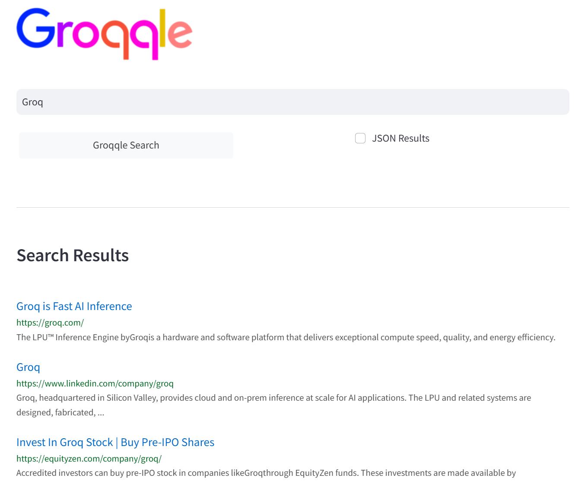
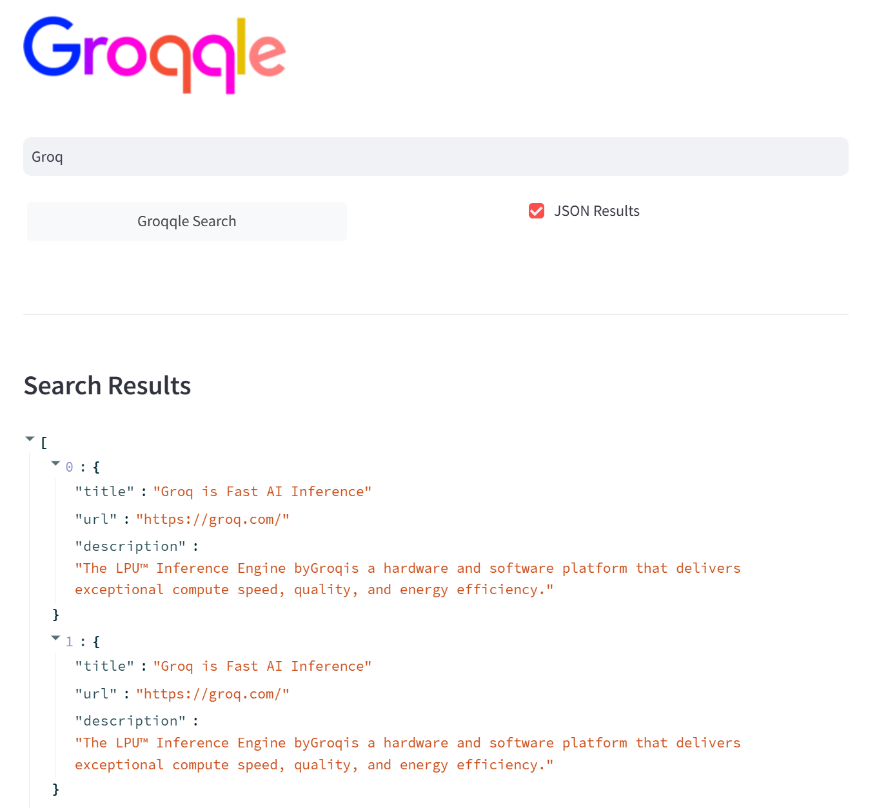
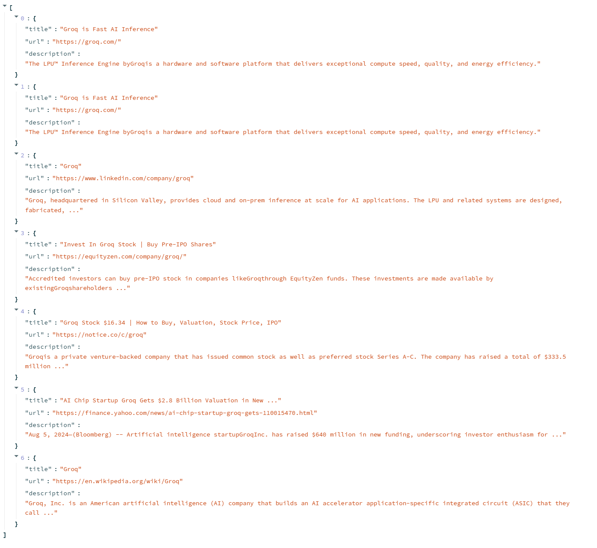

# Groqqle 2.1: Your Free AI-Powered Search Engine and Content Generator


Groqqle 2.1 is a revolutionary, free AI web search and API that instantly returns ORIGINAL content derived from source articles, websites, videos, and even foreign language sources, for ANY target market of ANY reading comprehension level! It combines the power of large language models with advanced web and news search capabilities, offering a user-friendly web interface, a robust API, and now a powerful Groqqle_web_tool for seamless integration into your projects.

Developers can instantly incorporate Groqqle into their applications, providing a powerful tool for content generation, research, and analysis across various domains and languages.

[](https://opensource.org/licenses/MIT)
[](https://www.python.org/downloads/)

## 🌟 Features

- 🔍 Advanced search capabilities powered by AI, covering web and news sources
- 📝 Instant generation of ORIGINAL content based on search results
- 🌐 Ability to process and synthesize information from various sources, including articles, websites, videos, and foreign language content
- 🎯 Customizable output for ANY target market or audience
- 📚 Adjustable reading comprehension levels to suit diverse user needs
- 🖥️ Intuitive web interface for easy searching and content generation
- 🚀 Fast and efficient results using Groq's high-speed inference
- 🔌 RESTful API for quick integration into developer projects
- 🛠️ Groqqle_web_tool for direct integration into Python projects
- 🔒 Secure handling of API keys through environment variables
- 📊 Option to view results in JSON format
- 🔄 Extensible architecture for multiple AI providers
- 🔢 Configurable number of search results
- 🔤 Customizable maximum token limit for responses



## 🚀 Why Choose Groqqle 2.1?

Groqqle 2.1 stands out as a powerful tool for developers, researchers, content creators, and businesses:

- **Instant Original Content**: Generate fresh, unique content on any topic, saving time and resources.
- **Multilingual Capabilities**: Process and synthesize information from foreign language sources, breaking down language barriers.
- **Flexible Output**: Tailor content to any target market or audience, adjusting complexity and style as needed.
- **Easy Integration**: Developers can quickly incorporate Groqqle into their projects using the web interface, API, or the new Groqqle_web_tool.
- **Customizable Comprehension Levels**: Adjust the output to match any reading level, from elementary to expert.
- **Diverse Source Processing**: Extract insights from various media types, including articles, websites, and videos.

Whether you're building a content aggregation platform, a research tool, or an AI-powered writing assistant, Groqqle 2.1 provides the flexibility and power you need to deliver outstanding results.

## 🛠️ Installation

1. Clone the repository:
   ```bash
   git clone https://github.com/jgravelle/Groqqle.git
   cd Groqqle
   ```

2. Set up a Conda environment:
   ```bash
   conda create --name groqqle python=3.11
   conda activate groqqle
   ```

3. Install the required packages:
   ```bash
   pip install -r requirements.txt
   ```

4. Set up your environment variables:
   Create a `.env` file in the project root and add your Groq API key:
   ```env
   GROQ_API_KEY=your_api_key_here
   ```

5. Install PocketGroq:
   ```bash
   pip install pocketgroq
   ```

## 🚀 Usage

### Web Interface

1. Start the Groqqle application using Streamlit:
   ```bash
   streamlit run Groqqle.py
   ```

2. Open your web browser and navigate to the URL provided in the console output (typically `http://localhost:8501`).

3. Enter your search query in the search bar.

4. Choose between "Web" and "News" search using the radio buttons.

5. Click "Groqqle Search" or press Enter.

6. View your results! Toggle the "JSON Results" checkbox to see the raw JSON data.

7. For both web and news results, you can click the "📝" button next to each result to get a summary of the article or webpage.



### API

The Groqqle API allows you to programmatically access search results for both web and news. Here's how to use it:

1. Start the Groqqle application in API mode:
   ```bash
   python Groqqle.py api --num_results 20 --max_tokens 4096
   ```

2. The API server will start running on `http://127.0.0.1:5000`.

3. Send a POST request to `http://127.0.0.1:5000/search` with the following JSON body:
   ```json
   {
     "query": "your search query",
     "num_results": 20,
     "max_tokens": 4096,
     "search_type": "web"  // Use "web" for web search or "news" for news search
   }
   ```

   Note: The API key is managed through environment variables, so you don't need to include it in the request.

4. The API will return a JSON response with your search results in the order: title, description, URL, source, and timestamp (for news results).

Example using Python's `requests` library:

```python
import requests

url = "http://127.0.0.1:5000/search"
data = {
    "query": "Groq",
    "num_results": 20,
    "max_tokens": 4096,
    "search_type": "news"  # Change to "web" for web search
}
response = requests.post(url, json=data)
results = response.json()
print(results)
```

Make sure you have set the `GROQ_API_KEY` in your environment variables or `.env` file before starting the API server.



### Groqqle_web_tool

The new Groqqle_web_tool allows you to integrate Groqqle's powerful search and content generation capabilities directly into your Python projects. Here's how to use it:

1. Import the necessary modules:
   ```python
   from pocketgroq import GroqProvider
   from groqqle_web_tool import Groqqle_web_tool
   ```

2. Initialize the GroqProvider and Groqqle_web_tool:
   ```python
   groq_provider = GroqProvider(api_key="your_groq_api_key_here")
   groqqle_tool = Groqqle_web_tool(api_key="your_groq_api_key_here")
   ```

3. Define the tool for PocketGroq:
   ```python
   tools = [
       {
           "type": "function",
           "function": {
               "name": "groqqle_web_search",
               "description": "Perform a web search using Groqqle",
               "parameters": {
                   "type": "object",
                   "properties": {
                       "query": {
                           "type": "string",
                           "description": "The search query"
                       }
                   },
                   "required": ["query"]
               }
           }
       }
   ]

   def groqqle_web_search(query):
       results = groqqle_tool.run(query)
       return results
   ```

4. Use the tool in your project:
   ```python
   user_message = "Search for the latest developments in quantum computing"
   system_message = "You are a helpful assistant. Use the Groqqle web search tool to find information."

   response = groq_provider.generate(
       system_message,
       user_message,
       tools=tools,
       tool_choice="auto"
   )

   print(response)
   ```

This new tool allows for seamless integration of Groqqle's capabilities into your Python projects, enabling powerful search and content generation without the need for a separate API or web interface.

## 🔄 AI Providers

While Groqqle is optimized for use with Groq's lightning-fast inference capabilities, we've also included stubbed-out provider code for Anthropic. This demonstrates how easily other AI providers can be integrated into the system. 

To use a different provider, you can modify the `provider_name` parameter when initializing the `Web_Agent` in the `Groqqle.py` file.

## 🎛️ Configuration Options

Groqqle now supports the following configuration options:

- `num_results`: Number of search results to return (default: 10)
- `max_tokens`: Maximum number of tokens for the AI model response (default: 4096)
- `model`: The Groq model to use (default: "llama3-8b-8192")
- `temperature`: The temperature setting for content generation (default: 0.0)
- `comprehension_grade`: The target comprehension grade level (default: 8)

These options can be set when running the application, making API requests, or initializing the Groqqle_web_tool.

## 🤝 Contributing

We welcome contributions to Groqqle! Here's how you can help:

1. Fork the repository
2. Create your feature branch (`git checkout -b feature/AmazingFeature`)
3. Commit your changes (`git commit -m 'Add some AmazingFeature'`)
4. Push to the branch (`git push origin feature/AmazingFeature`)
5. Open a Pull Request

Please make sure to update tests as appropriate and adhere to the [Code of Conduct](CODE_OF_CONDUCT.md).

## 📄 License

Distributed under the MIT License. See `LICENSE` file for more information. Mention J. Gravelle in your docs (README, etc.) and/or code. He's kind of full of himself.

## 📞 Contact

J. Gravelle - j@gravelle.us - https://j.gravelle.us

Project Link: [https://github.com/jgravelle/Groqqle](https://github.com/jgravelle/Groqqle)

## 🙏 Acknowledgements

- [Groq](https://groq.com/) for their powerful and incredibly fast language models
- [Streamlit](https://streamlit.io/) for the amazing web app framework
- [Flask](https://flask.palletsprojects.com/) for the lightweight WSGI web application framework
- [Beautiful Soup](https://www.crummy.com/software/BeautifulSoup/) for web scraping capabilities
- [PocketGroq](https://github.com/CaseCal/pocketgroq) for the Groq provider integration

